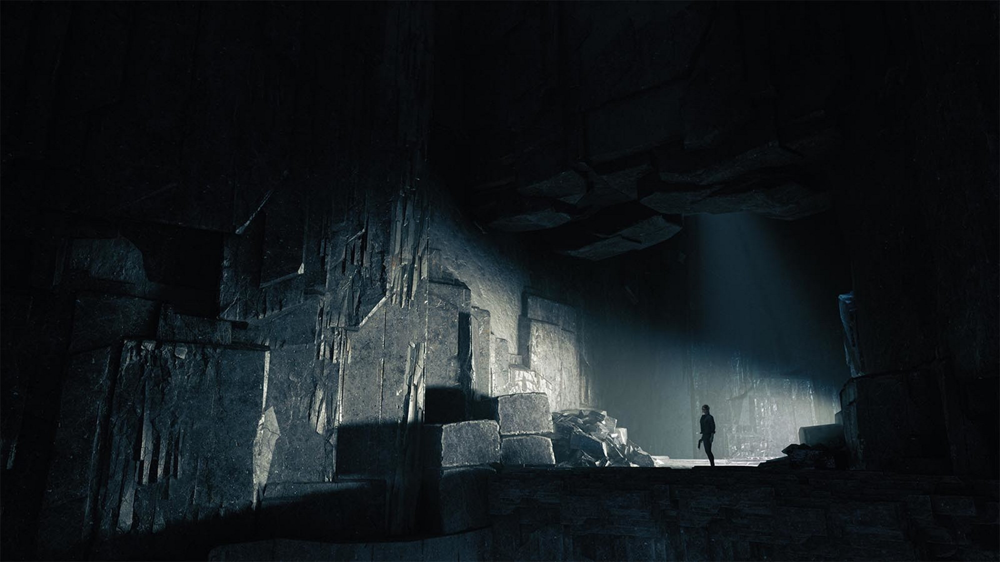
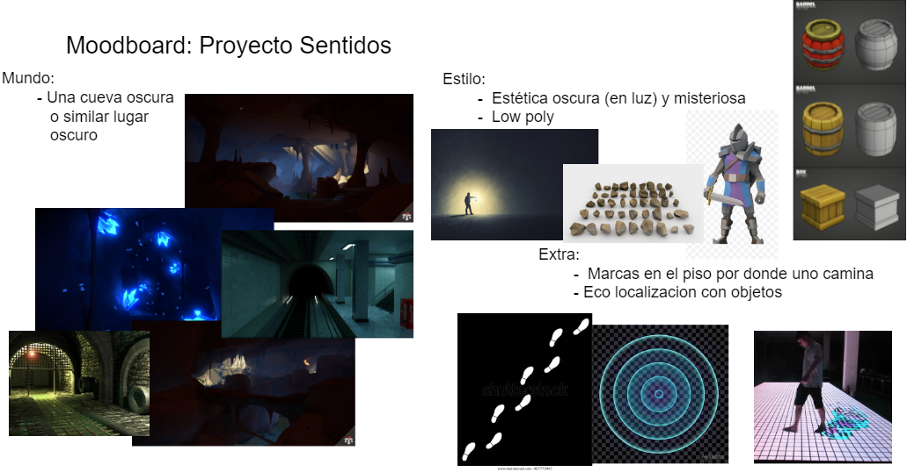
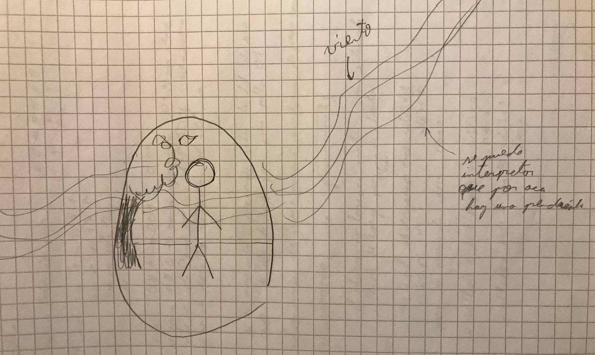
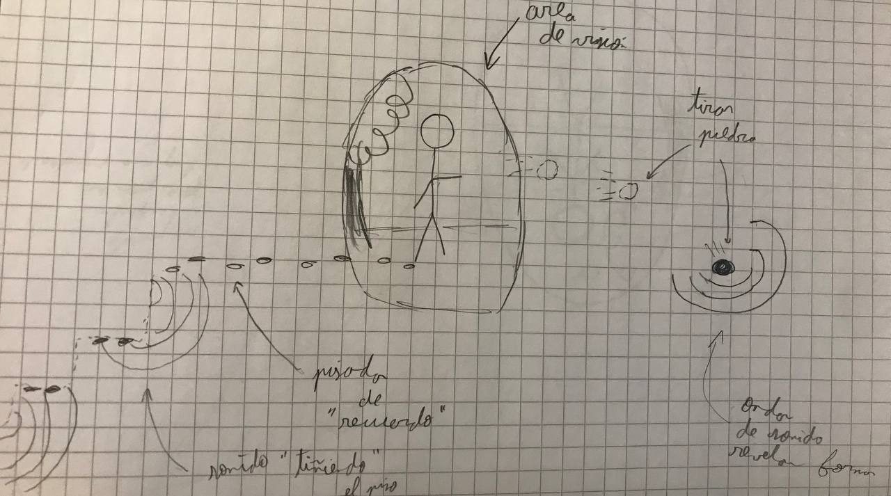

# Proyecto Sentidos

Plataforma: PC

Audiencia objetivo: Adolescentes y Adultos con afición a puzzle-platformers

Equipo: Bacan Studios

Integrantes:
- Vicente Gonzales
- Rodrigo Iturrieta
- Pablo Jaramillo
- Diego Torreblanca

## 1. Historia
El protagonista se encuentra colgando de una celda, la cual por la antigüedad tiene deja una pequeña apertura lo suficientemente grande como para que este pase por agachado. Este procede por el orificio, se escapa y cae al piso, donde se percata que todo a su alrededor esta muy oscuro, excepto por una antorcha que le da luz, este la toma y recorre un largo pasillo donde finalmente se le apaga, sigue avanzando y se puede divisar un pequeño haz de luz que le señala un altar donde se ve una criatura igual de pequeña que el haz, la cual le ofrece ayuda en forma de un contrato. La criatura no puede escapar por cuenta propia, por lo que le ofrece al protagonista poderes sensoriales para que puedan escapar juntos.

A medida que avanza el protagonista se encuentra con inscripciones en las paredes que cuentan sobre como el mundo exterior se ha visto enfrentado por una peste, y para buscar salvación la humanidad envió a varias personas a buscar los fragmentos de un antiguo dios que solia vivir en la montaña, las pistas se acumulan hasta que el protagonista se percata que probablemente no existe un mundo al cual escapar, por lo que decide volver y adentrarse lo más posible para lograr el cometido por el que fue originalmente hace años.

Finalmente cuando el personaje llega pronfundo dentro de la cueva logra encontrar el santuario destinado para salvar a la humanidad, pero una vez ahi se da cuenta que ha llegado muy tarde y el artfacto divino profetizado fue destruido hace mucho tiempo. Entonces el protagonista pierde la fe.

## 2. Flujo

El flujo del juego es en torno a la exploración del ambiente, la cual se lleva a cabo interactuando físicamente con este para revelarlo. 

El desafío del juego radica en que es difícil navegar por el mapa debido a la falta de visibilidad, entonces el desafío se incrementará con la complejidad de geometría de los niveles. 

Para recompensar al jugador conforme progrese se irán desbloqueando más formas de poder percibir el mapa, inicialmente solo se tendrá la posibilidad de ver sonido, pero después se progresara a recordar pisadas, percepción de calor o viento, entre otros.

## 3. Personajes y controles

### Personajes
El personaje/La personaje principal: será el  jugador y será completamente responsable de explorar las cuevas hasta poder escapar.

Espíritu: es la razón detrás de las capacidades perceptivas del jugador, busca formar una alianza simbiótica con el personaje principal para que ambos puedan escapar

### Mapa de controles

|Input|Pc|Xbox|
|:---|:---|:---|
|Saltar|Space|A|
|Retroceder|A|Joystick_L.izquierda|
|Avanzar|D|Joystick_L.derecha|
|Mover hacia afuera|W|Joystick_L.arriba|
|Mover hacia adentro|S|Joystick_L.abajo|
|Apuntar/Mirar|Posición del ratón|Joystick_R|
|Acción principal|Click izquierdo|X|
|Acción secundaria (posible)|Click derecho|Y|
|Agacharse|Control izquierdo|B|
|Cambiar objeto|E|RB|
|Mapa (posible)|Q|LB|

## 4. Gameplay

El juego es un puzzle platformer de exploración ambiental, donde se espera que el jugador interactue con la geometría del mapa y objetos esparcidos por el mapa, tocando muros, tirando objetos, sacudiendo decoraciones, etc.

El juego se encuentra dividido en niveles que deben ser transitados para pasar al siguiente. No se tienen contemplado minijuegos, el gameplay será centrado en el concepto central de la exploración en la oscuridad por medio de los varios sentidos del personaje.

## 5. Mundo

El mundo del juego corresponde a una gran cueva oscura, con varios objetos que muestren que la era del juego es mediaval, la intención de este ambiente es transmitir un aire de misticismo y misterio. Si bien no se podrá percibir en detalle dado a la oscuridad, se espera dar un sentido de progresion gradualmente cambiando los objetos alrededor para dar ideas de donde es que uno podría estar ubicado, transicionando entre cuevas, minas, bases subterraneas, etc.

## 6. Mécanicas y poderes

- Agarrar objetos de pequeño tamaño
- Arrojar objetos de pequeño tamaño
- Saltar
- Agacharse
- Golpear paredes
- Ver sonidos (obtenido al comienzo del juego)
- Ver pisadas viejas (obtenido al progresar en el juego)
- Ver viento (obtenido al progresar en el juego)
- Ver calor (obtenido al progresar en el juego)

## 7. Enemigos y jefes

No existirán enemigos convencionales en el juego, de incluirse serían obstaculos dinamicos que se pueden derrotar o evitar resolviendo puzzles.

## 8. Extras

Se puede notar que algunos elementos del juego tienen analogos en otros juegos, como por ejemplo:

- Exploración por interacción física: The Unfinished Swan
- Vision de olor: League of Legends - Warwick (habilidad W)
- Ver pisadas antiguas: The Witcher 3: Wild Hunt
- Ver viento: Journey
